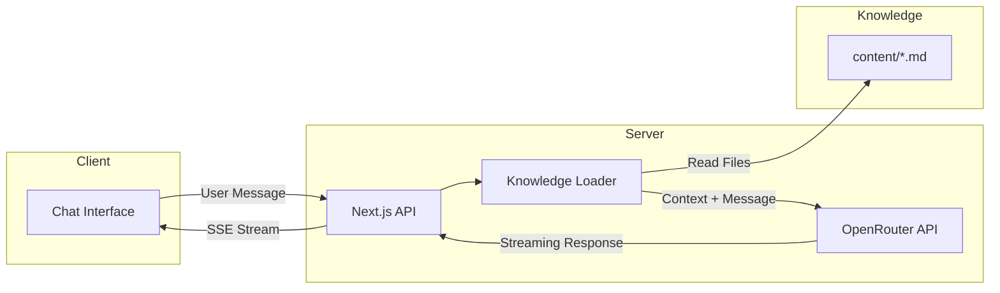
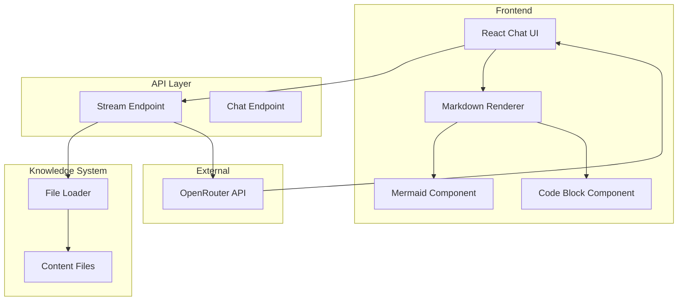
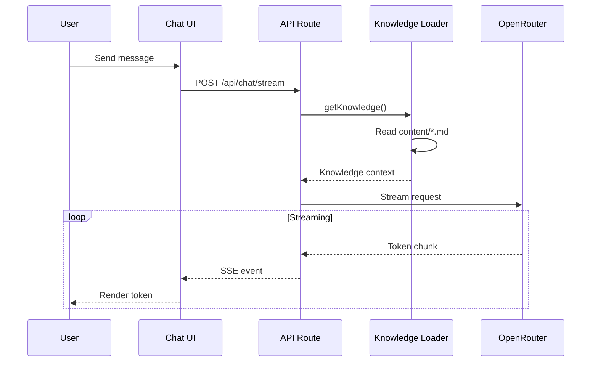

<div align="center">

## Knowledge-Assistant

#### A free, file-based chat agent that answers questions from your custom knowledge files. Ideal for building domain-specific AI assistants or interactive documentation for GitHub projects, allowing users to query your codebase through natural conversation.


</div>

Knowledge AI loads markdown files from a `content/` directory and uses them as context for AI responses. This approach provides accurate, domain-specific answers without the complexity of vector databases or embeddings.



## Quick Start

### Prerequisites

- Node.js 18+
- OpenRouter API key ([get one free](https://openrouter.ai))

### Installation

```bash
cd knowledge-assistance
npm install
cp .env.example .env.local
```

Edit `.env.local` with your API key:

```env
OPENROUTER_API_KEY=your_api_key_here
NEXT_PUBLIC_SITE_URL=http://localhost:3000
```

### Running

```bash
npm run dev       # Development
npm run build     # Production build
npm start         # Start production server
```

Access the application at `http://localhost:3000`

## Architecture



## Knowledge System

Add knowledge by placing markdown files in the `content/` directory:

```
content/
  knowledge.md           # General domain knowledge
  n8n-workflow-guide.md  # n8n workflow JSON reference
  n8n-ai-nodes.md        # AI/LangChain node examples
  n8n-patterns.md        # Common workflow patterns
  mermaid-syntax.md      # Mermaid diagram reference
```

The AI reads all `.md` and `.txt` files at request time and uses them as context for responses.

### Knowledge File Structure

Each knowledge file should be focused on a specific topic:

```markdown
# Topic Title

Brief overview of the topic.

## Section 1

Detailed information with examples.

## Section 2

Code examples in fenced blocks.
```

## Project Structure

```
knowledge-assistance/
  app/
    api/
      chat/
        route.ts          # Non-streaming endpoint
        stream/
          route.ts        # Streaming endpoint
    layout.tsx
    page.tsx
    globals.css
  components/
    chat.tsx              # Main chat interface
    mermaid.tsx           # Mermaid and code block rendering
    ui/                   # Shadcn UI components
  content/                # Knowledge files
  lib/
    utils.ts
```

## API Endpoints

### POST /api/chat/stream

Streaming chat endpoint using Server-Sent Events.

**Request:**

```json
{
  "message": "User message",
  "messages": [
    { "role": "user", "content": "Previous message" },
    { "role": "assistant", "content": "Previous response" }
  ]
}
```

**Response:** SSE stream with chunked content

### POST /api/chat

Non-streaming chat endpoint.

**Request:** Same as streaming endpoint

**Response:**

```json
{
  "response": "Complete AI response"
}
```

## Configuration

### Model Selection

The default model can be changed in `app/api/chat/stream/route.ts`:

```typescript
model: "xiaomi/mimo-v2-flash:free", // or any OpenRouter model
```

### Token Limits

Adjust response length:

```typescript
max_tokens: 4096,
```

## Data Flow


