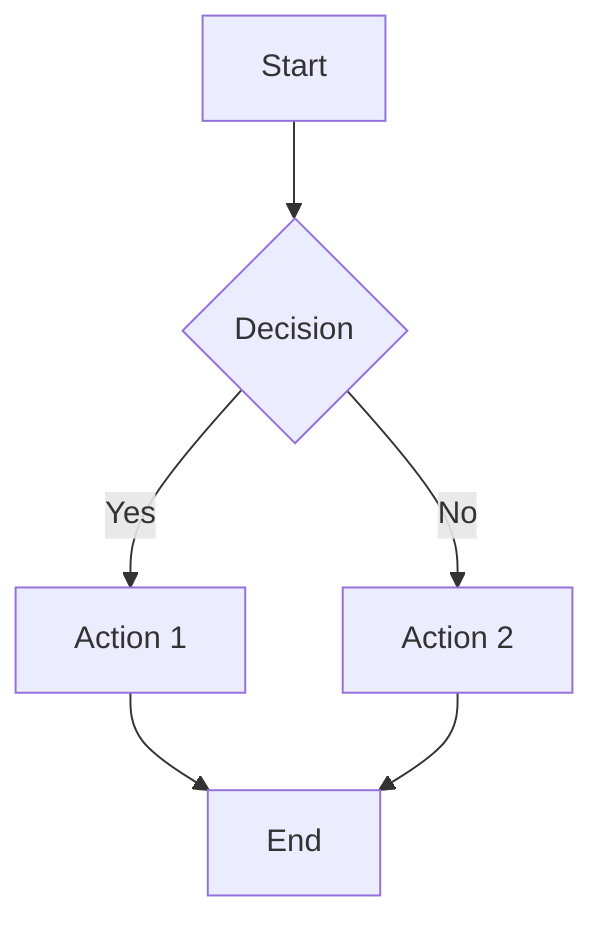
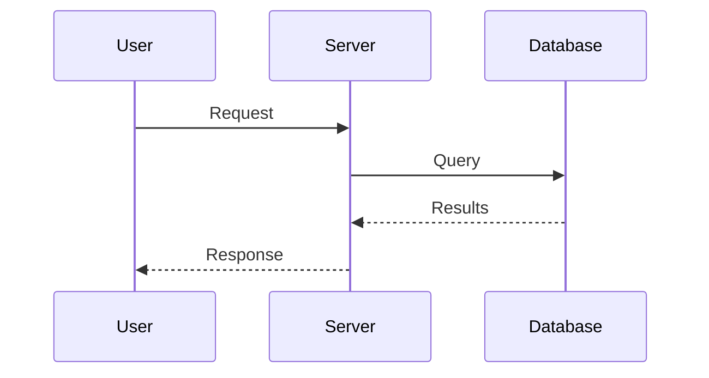
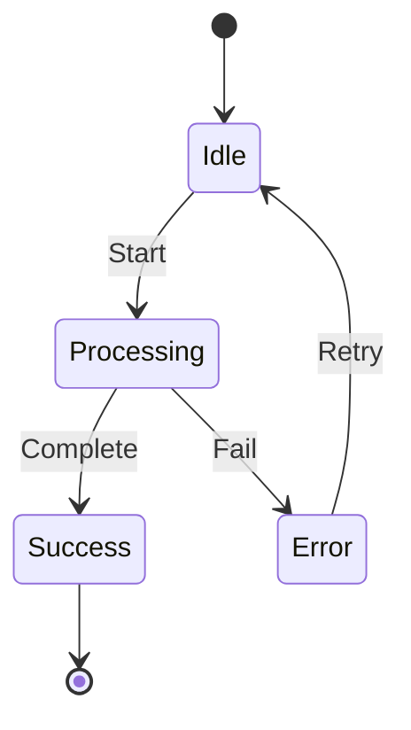
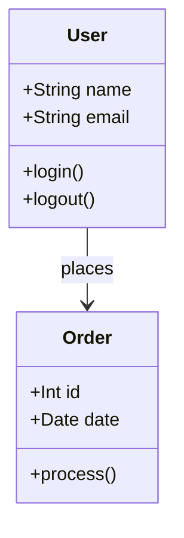
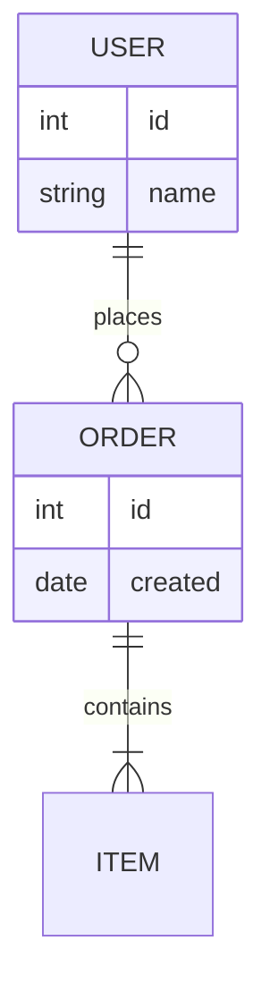
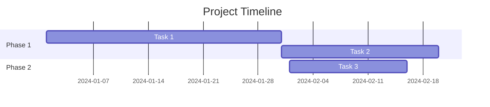

# Mermaid Diagram Syntax Guide

When creating diagrams, use mermaid syntax in code blocks. Here are correct examples:

## Flowchart

## Sequence Diagram

## State Diagram

## Class Diagram

## Entity Relationship

## Gantt Chart

## Important Rules

1. Always start with the diagram type (flowchart, sequenceDiagram, etc.)
2. Use proper indentation
3. Node IDs should be simple (A, B, C or descriptive like Start, End)
4. Labels go in brackets: `A[Label]` or `A(Rounded)` or `A{Diamond}`
5. Arrows: `-->` for solid, `-.->` for dotted, `==>` for thick
6. For sequence diagrams: `->>` request, `-->>` response
